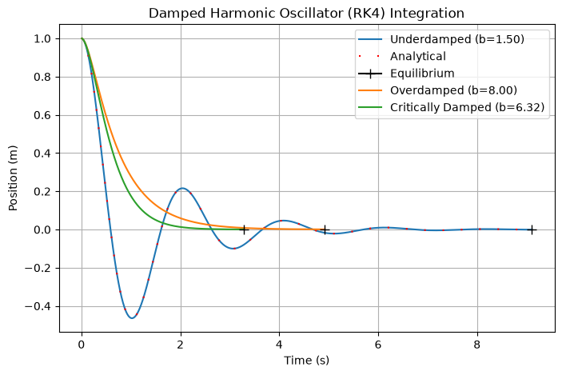
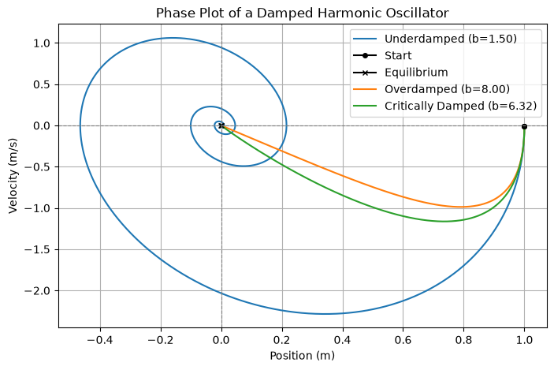
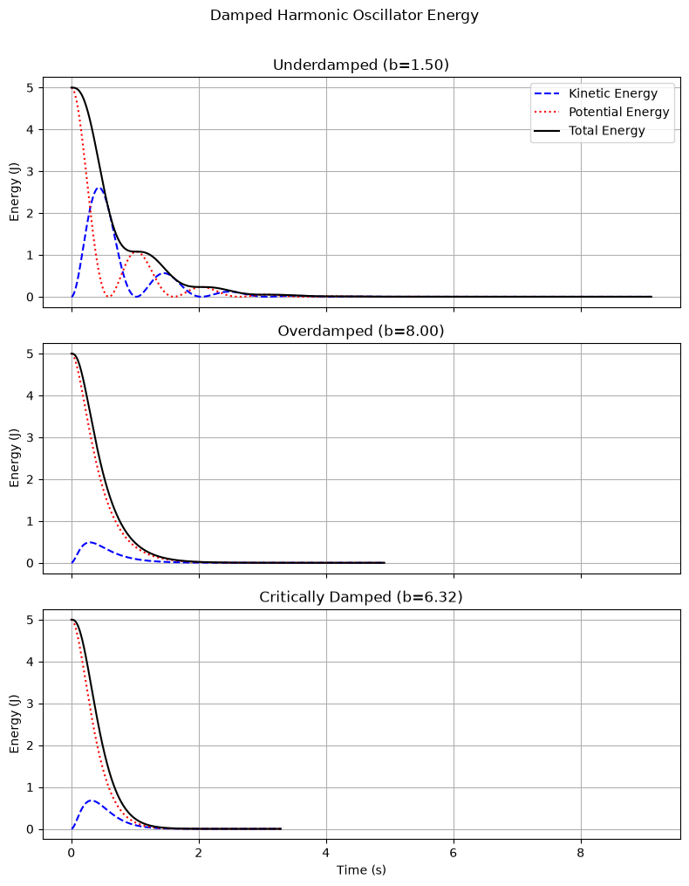
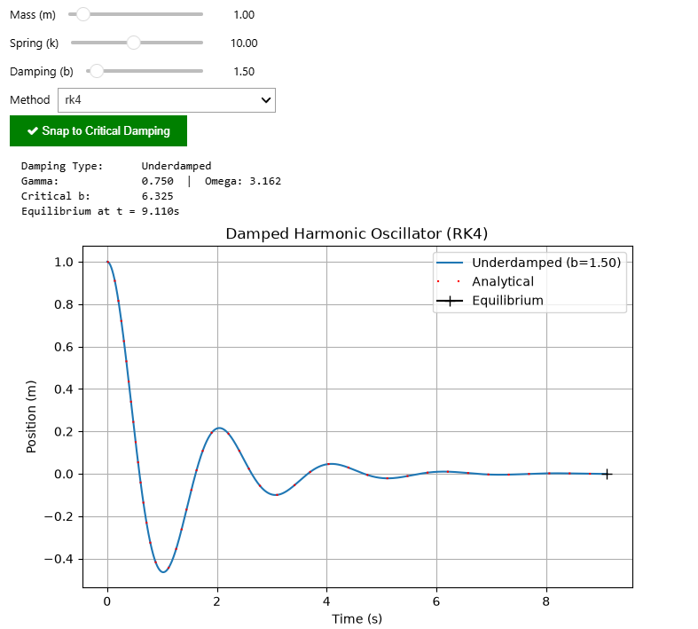
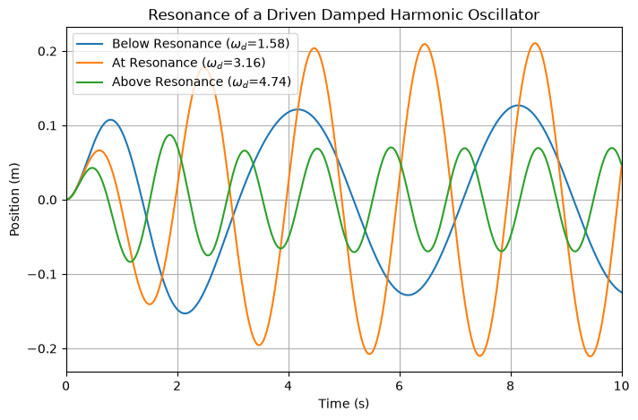

## Damped Harmonic Oscillator Simulation
A Python simulation and visualization of underdamped, overdamped, and critically damped 
harmonic oscillators using both Euler and RK4 numerical integration methods.


This project numerically solves the second-order differential equation:

$$\ddot{x} + 2\gamma\dot{x} + \omega^2x = 0$$

by converting it into a system of first-order ODEs and integrating forward in time. 
The numerical solution is validated against the analytical closed-form solution for 
each damping case.

> For the full derivation, see [theory.md](docs/theory.MD).

---

## Features
- Analytical solution overlay for numerical validation.
- Automatic equilibrium detection and markers.
- Models three damping cases:
    - Underdamped ($\gamma < \omega$): oscillates with decaying amplitude.
    - Overdamped ($\gamma > \omega$): returns to equilibrium slowly without oscillating.
    - Critically Damped ($\gamma = \omega$): returns to equilibrium as quickly as possible.
- Two numerical integration methods:
    - Euler's method.
    - Fourth-order Runge-Kutta (RK4).
- Interactive widget with sliders for:
    - Mass (m).
    - Spring Constant (k).
    - Damping Coefficient (b).
    - Integration method selection (Euler or RK4).
    - Snap to Critical Damping button.
- Phase portrait (velocity vs. position).
- Energy analysis (kinetic, potential, and total energy over time).
- Driven Oscillator and Resonance Analysis.

---

## Gallery

| Position Plot | Phase Portrait |
|---|---|
|  |  |

| Energy Plot | Euler vs RK4 |
|---|---|
|  |  |

| Resonance Analysis | |
|---|---|
|  | |

---

## Physics Background
A harmonic oscillator is a system that experiences oscillations due to a restoring force 
proportional to its displacement from equilibrium. Real systems lose energy over time due 
to friction or drag, which is captured by a damping term. The behavior of the system depends 
on the relationship between the damping constant $\gamma = \frac{b}{2m}$ and the natural 
frequency $\omega = \sqrt{\frac{k}{m}}$.

---

## Requirements
- Python 3
- NumPy
- Matplotlib
- ipywidgets

Install all dependencies with:  
```bash
pip install numpy matplotlib ipywidgets
```
---

## File Structure
```
HarmonicOscillator/
├── docs/
│   └── theory.MD
├── images/
│   ├── animation_v2.gif
│   ├── position_plot_v2.png
│   ├── phase_plot_v2.png
│   ├── energy_plot.png
│   ├── euler_vs_rk4.png
│   └── resonance_plot.png
├── notebooks/
│   └── HarmonicOscillator.ipynb
└── README.md
```

## Quick Start
1. Clone the repository.
2. Install the requirements.
3. Open `notebooks/HarmonicOscillator.ipynb` in Jupyter or VS Code.
4. Run all cells.

---

## Author
Zachary Lee
