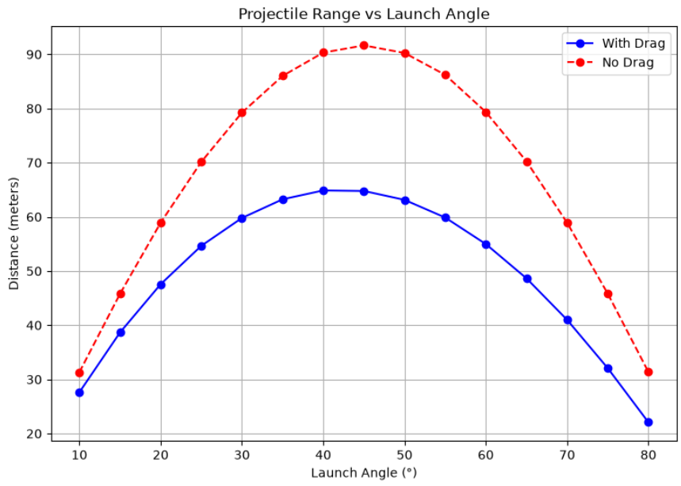
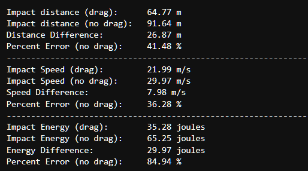

# Projectile Motion Simulator
Author: Zachary Lee
<hr>

An interactive physics simulation that models the 2D motion of a projectile when quadratic drag is present and not present.
This tool visualizes trajectories, speed, and energy in real time using adjustable parameters and presets for common objects.
It compares both values by outputting them through text and outputting them on the same plots.


> For the full derivation, see [Physics_Background.md](docs/Physics_Background.md).

---

## Features
- Accurate quadratic drag model using `scipy.solve_ivp`
- Interactive Jupyter widget UI with presets (baseball, cannonball, etc.)
- Trajectory animation with trail + angle sweep analysis
- Energy conservation tracking and no-drag comparison
- Export results as CSV or GIF
- Well-documented, installable package

## How to Use
The simulation contains a UI that features various sliders, buttons, and checkboxes.


To generate a plot, select a preset or adjust the sliders and press the "run" button. After a few seconds, a plot will generate featuring the following:
- Projectile Trajectory
  - Shows the trajectory of the projectile and how drag affects the distance it travels.
- Animated Projectile
  - A projectile will move along the trajectory with variable speed that changes depending on inputted parameters.

You can also click the "run angle sweep" button to generate a plot that shows which launch angle will produce the greatest amount of travel.



The simulation also features a "save to .gif" and "export to .CSV" button so that you can save your animation and export the projectile's data to a spreadsheet.

Hitting the "reset" button will set the slider values to match that of a baseball.

Finally, when you click "run", the projectile's distance, speed, and energy at impact will display.



## Getting Started

### Prerequisites
- Python 3.8 or higher
- Jupyter Notebook or JupyterLab

### Installation
```bash
git clone https://github.com/ztleeUT/Physics-Simulations.git
cd Physics-Simulations/ProjectileMotion
pip install -e .
```

### Running the Project
```python
from projectilemotion import run_simulation, plot_trajectory
results = run_simulation(v0=50, angle=45, drag=True)
plot_trajectory(results)
```
See `notebooks/ProjectileMotion.ipynb` for the full interactive demo.

## Physics Model
The simulation solves a system of four coupled ODEs representing:
- Horizontal position $x$
- Vertical position $y$
- Horizontal velocity $v_x$
- Vertical velocity $v_y$

### No‑Drag Model
- $\frac{dx}{dt} = v_x$
- $\frac{dy}{dt} = v_y$
- $\frac{dv_x}{dt} = 0$
- $\frac{dv_y}{dt} = -g$

### Quadratic Drag Model
Drag force:
- $F_d = -c v^2$

Resulting accelerations:
- $a_x = -\frac{c}{m} \cdot v \cdot v_x$
- $a_y = -g - \frac{c}{m} \cdot v \cdot v_y$

### Ground Impact Detection
An event function stops integration when:
- $y(t) = 0$

This allows accurate calculation of:
- Impact distance
- Impact speed
- Impact kinetic energy

## Real-World Applications
Projectile motion with quadratic drag is foundational to ballistics, artillery analysis, and aerospace trajectory design. Accounting for drag rather than assuming idealized vacuum motion is essential for accurately predicting range, impact velocity, and energy in any system where air resistance meaningfully affects flight, from sports physics to defense and aerospace applications. This project's drag model and impact detection form the physics foundation used later in [MonteCarloCEP](../MonteCarloCEP/README.md) for statistical dispersion analysis.
